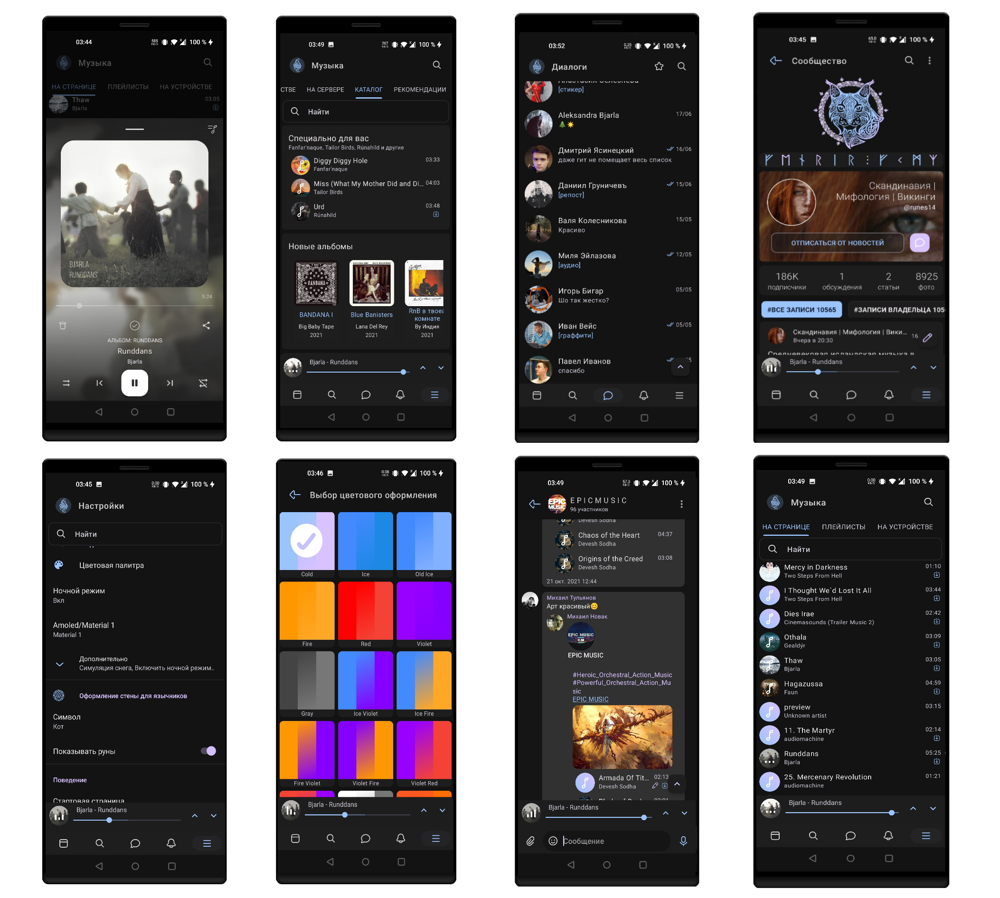
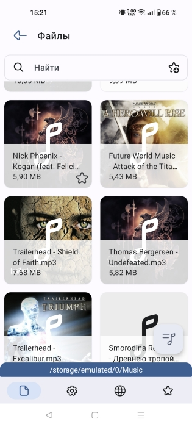

# Fenrir VK
Первый языческий

За основу взят проект Phoenix (R)

<b>Языки: Русский, английский</b>

По поводу функционала и т.д. - многие существующие моды и т.д. построены на официальном приложении. Этот клиент написан с нуля, поэтому многих привычных функций не будет, либо будут выглядить иначе.

<b>Скриншоты:</b>

<b>Инструкция по сборке:</b> 
Требуется: 
  1) Android Studio Meerkat 2024.3.1 или выше. Kotlin 2.1.*
  2) Android SDK 35
  3) Android NDK 28.0.12916984
  
  Если не работает музыка в Fenrir Kate, обновите kate_receipt_gms_token в app.build_config. 
  Взять токен можно из Kate Mobile Extra Mod
  
<b>Компиляция:</b>

  1) Для релизных сборок вам нужен сертификат.
        keytool -genkey -v -keystore Fenrir.keystore -alias fenrir -storetype PKCS12 -keyalg RSA -keysize 2048 -validity 10000
  2) Далее нужно собрать нативную библиотеку: 
        Создать папку compiled_native, раскомментировать [include ":native"] в settings.gradle 
        cd native 
        ./ffmpeg.sh 
        после синхронизации репозитория ffmpeg введите min sdk version 
        после сборки ffmpeg соберите native в Android Studio и поместите native-release.aar в compiled_native 
  3) Выберите flavor - fenrir или kate и Debug или Release и соберите apk :)

Локальный медиа сервер https://github.com/umerov1999/FenrirMediaServer/releases

<b>Старые репозитории:</b>

  1) https://github.com/umerov1999/Old_Fenrir-for-VK Release 1
  2) https://github.com/umerov1999/Old2_Fenrir-for-VK Release 2
  3) https://github.com/umerov1999/Fenrir-for-VK Финальный релиз

# FileGallery
Просмотр фото, видео, аудио, тэги

<b>Языки: Русский</b>

<b>Скриншот:</b>

